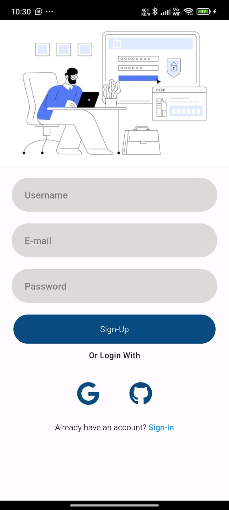
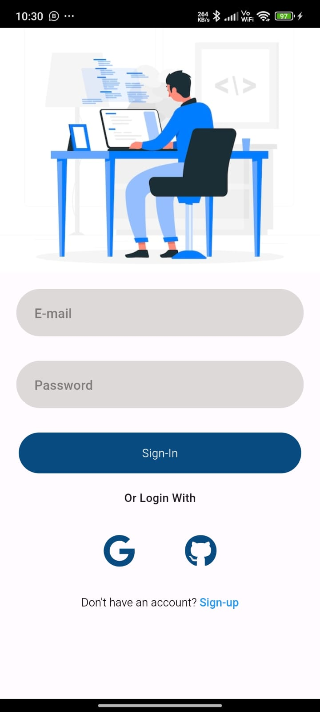

# Flutter Authentication App

This Flutter application demonstrates how to implement authentication functionalities including sign-up, sign-in, and sign-in with Google using Firebase Authentication and GitHub OAuth.

## Getting Started

To get started with this project, follow these steps:

1. **Clone the Repository:**
   ```bash
   git clone https://github.com/ssdevloper/Authentication_Page_Flutter
   cd Authentication_Page_Flutter

2 **Install All The Dependencies and Package**
  ```bash
  visit pub.dev webpage and search the packages
  command

  flutter pub get  

  Run command

  flutter run as well as flutter build

  ```
 3 **Create Firebase Account and Connect with Your Flutter App**
  
  visit firebase webpage and create project file
  
  install firebase
 
  and Install all packages firbase
 
 ## Screenshots
 <div>



</div> 
  

### Notes:
- Replace `<repository-url>` with your actual repository URL.
- Make sure to provide accurate Firebase and GitHub setup instructions based on your project configuration.
- Include screenshots or additional sections as needed to provide clarity and documentation for your application.

This `README.md` file structure provides a comprehensive guide for setting up and running your Flutter authentication app, including Firebase and GitHub OAuth configurations and addressing potential issues like the GitHub authentication challenge. Adjust the sections and details according to your specific application requirements and implementation details.
